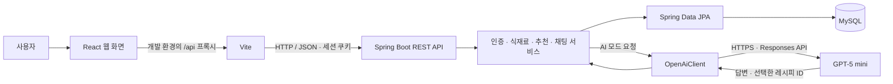
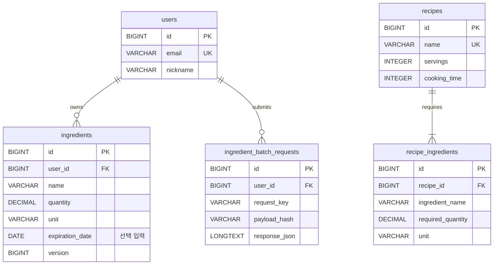

# 냉장고 지킴이 · Fridge Gatekeeper

## 보유 식재료를 오늘의 한 끼로 연결하는 웹 서비스

> **발표 핵심:** 냉장고 재료를 쉽게 등록하고, 유통기한과 보유량을 확인하며, 내 재료에 맞는 레시피와 AI 요리 상담을 제공하는 서비스입니다.
>
> 갱신: 2026-09-19. 여러 식재료 한 번에 추가·목록 붙여넣기 UI와 일괄 등록 API까지 반영했습니다. 검증 결과는 10번에서 이번 변경의 재검증과 이전 AI 품질 확인을 구분합니다.

이 문서는 **화면 시연 약 2~3분을 포함해 총 10~12분으로 발표할 수 있는 구성**입니다. 1~12번에서 핵심 표와 요점을 슬라이드로 옮기고, 상세 설명은 발표자 참고 자료로 활용하세요. 각 항목의 **발표 멘트**는 말로 풀어 설명하는 예시입니다. 부록은 질의응답과 상세 기술 설명에 사용합니다. 발표 시간이 5분이면 1·2·4·5·6·7·12번의 핵심과 짧은 시연을 중심으로 구성하면 됩니다.

---

## 1. 프로젝트 소개

| 항목 | 내용 |
| --- | --- |
| 프로젝트명 | 냉장고 지킴이 · Fridge Gatekeeper |
| 서비스 유형 | PC와 모바일 화면에 대응하는 반응형 웹 서비스 |
| 주요 대상 | 식재료를 관리하고 보유 재료로 식사를 준비하려는 사용자 |
| 핵심 흐름 | 회원가입 → 식재료 등록 → 냉장고 상태 확인 → 레시피 추천 → AI 요리 상담 |
| 구현 상태 | 로컬에서 실행·검증한 MVP. 공개 운영 배포는 후속 과제 |

**발표 멘트**

> 냉장고 지킴이는 집에 있는 재료를 바탕으로 무엇을 만들 수 있는지 알려주는 웹 서비스입니다. 식재료 관리, 유통기한 확인, 레시피 추천, AI 상담을 하나의 흐름으로 연결했습니다.

## 2. 해결하려는 문제와 서비스 방향

| 일상에서 겪는 불편 | 프로젝트에서 제공하는 기능 |
| --- | --- |
| 냉장고에 무엇이 얼마나 있는지 기억하기 어렵다 | 사용자별 식재료 목록과 수량 관리 |
| 유통기한이 가까운 재료를 놓치기 쉽다 | 오늘까지·임박·만료 상태를 대시보드에 표시 |
| 레시피를 찾아도 집에 없는 재료가 많다 | 보유 재료를 많이 활용하는 메뉴부터 추천하고 부족량 표시 |
| 식재료 정보를 매번 직접 입력하기 번거롭다 | 여러 재료 선택·장본 목록 붙여넣기·한 번에 저장·선택적 유통기한 등록 |
| 추천 목록만으로는 원하는 조건을 설명하기 어렵다 | 자연어 질문과 후속 대화를 처리하는 AI 요리 도우미 |

목표는 **기록 부담을 줄이고, 보유 재료를 활용할 판단 근거를 제공하는 것**입니다. 식재료 낭비와 메뉴 고민을 줄이는 효과를 기대하지만, 실제 절감률이나 이용자 만족도를 측정한 프로젝트는 아닙니다.

**발표 멘트**

> 재료를 기록하는 과정이 번거로우면 서비스를 계속 사용하기 어렵습니다. 그래서 등록은 간편하게 만들고, 저장한 정보가 유통기한 관리와 추천에 바로 활용되도록 구성했습니다.

## 3. 사용 기술과 역할

버전은 현재 저장소의 설정 파일을 기준으로 정리했습니다.

| 영역 | 사용 기술 | 프로젝트에서 맡은 역할 |
| --- | --- | --- |
| 프론트엔드 | **React 19.2.8**, JavaScript·JSX | 화면, 재사용 컴포넌트, 입력 폼과 대화 상태 관리 |
| 개발·빌드 | **Vite 8.2.2**, Node.js·npm | 개발 서버, `/api` 프록시, 배포용 정적 파일 빌드 |
| 화면 구성 | HTML, CSS, 브라우저 History API | 반응형 배치, 대화상자, 화면 이동과 뒤로가기 처리 |
| 백엔드 | **Java 21**, **Spring Boot 4.1.1**, Spring MVC | REST API, 요청 처리, 업무 로직 실행 |
| 데이터 접근 | **Spring Data JPA** | 회원·식재료·레시피 조회 및 저장, 트랜잭션, 수정 버전 관리 |
| 인증·입력 검증 | **Spring Security**, BCrypt, Jakarta Validation | 로그인 세션, CSRF 방어, 비밀번호 해시, 입력값 검증 |
| 데이터베이스 | **MySQL 8** | 회원 정보, 사용자 재고, 레시피와 필요 재료의 영구 저장 |
| DB 변경 관리 | **Flyway** | 테이블 생성, 초기 레시피 입력, 스키마 변경 이력 적용 |
| AI 연동 | **GPT-5 mini**, OpenAI Responses API | 현재 냉장고와 질문 조건에 맞는 요리 답변 및 메뉴 선택 |
| 외부 API 통신 | Java HttpClient, Jackson 3 | 서버에서 OpenAI HTTP 호출, JSON 생성·해석·응답 검증 |
| 테스트 | JUnit·Spring 테스트, H2, Node.js 테스트 러너, Playwright | 서버·통신·추천 계산·데스크톱 및 모바일 화면 검증 |
| 코드·실행 관리 | Git·GitHub, Maven Wrapper, PowerShell 스크립트 | 버전 관리, JAR 빌드, Windows DB·서버 실행 |

현재 Windows에서 검증한 DB는 **MySQL 8.0.44**입니다. 별도로 `compose.yaml`에 MySQL 8.4 개발 환경 구성이 있으며, 해당 Docker 구성의 실제 기동은 기존 검증 범위에 포함되지 않았습니다.

**발표 멘트**

> React가 사용자 화면을 구성하고, Spring Boot가 인증과 재료 관리, 추천 계산을 담당합니다. 데이터는 MySQL에 저장하며, AI 질문이 들어올 때 백엔드에서 GPT-5 mini를 호출합니다. Flyway로 DB 구조 변경도 코드와 함께 관리합니다.

## 4. 시스템 구조와 데이터 흐름



그림을 표시하지 못하는 환경에서는 **브라우저 → 백엔드 → MySQL**, AI 질문은 **백엔드 → OpenAI → 백엔드**로 읽으면 됩니다. Vite 프록시는 현재 개발 환경의 연결 방식입니다.

백엔드는 기능별 패키지로 나눈 하나의 Spring Boot 애플리케이션입니다.

| 구성 | 역할 | 예시 |
| --- | --- | --- |
| Controller | HTTP 요청과 응답, 로그인 사용자 확인 | `IngredientController`, `ChatController` |
| Service | 날짜 판정, 재고 처리, 추천 계산, AI 문맥 구성 | `IngredientService`, `RecommendationService`, `ChatService` |
| Repository·Entity | DB 조회·저장, 테이블과 자바 객체 연결 | `IngredientRepository`, `Ingredient`, `Recipe` |

예를 들어 식재료를 저장하면 서버가 사용자와 입력값을 확인한 뒤 MySQL에 반영합니다. 이후 추천을 조회하면 저장된 최신 재고로 필요량·보유량·부족량을 다시 계산해 화면에 돌려줍니다.

**발표 멘트**

> 화면, 업무 규칙, 데이터 저장의 역할을 나눴습니다. AI도 백엔드를 통해 연결하므로 브라우저에 API 키를 전달하지 않고, 서버에서 계산한 재고 정보를 답변의 근거로 사용할 수 있습니다.

## 5. 주요 기능 — 간편한 식재료 등록과 냉장고 관리

### 5-1. 식재료 선택과 입력 편의

- 대시보드에서 바로 등록 창을 열고, **자주 쓰는 식재료 38종을 여러 개 선택**해 한 번에 저장합니다. 한 요청에 최대 50개입니다.
- 이름 검색, 카테고리 필터, `달걀 → 계란` 같은 등록된 별칭을 지원합니다.
- 일치하는 항목이 없을 때 `게란 → 계란`처럼 **한 글자 차이의 후보**를 제안하고 사용자가 선택합니다.
- 선택하면 수량·단위·분류·보관 위치의 편집 가능한 기본값과 오늘 구매 날짜를 채웁니다.
- **‘계란 6개, 두부 1모’처럼 장본 목록을 붙여넣을 수도 있습니다.** 쉼표·줄바꿈을 해석하며 외부 AI 호출이 필요하지 않습니다.
- 데스크톱은 선택 목록과 편집 영역을 나란히 보여주고, 모바일은 **수량·기한** 버튼으로 전환합니다. 수량·단위를 바로 수정하며 날짜·보관 정보는 필요한 재료만 펼칩니다.
- **유통기한은 비워 두어도 저장**됩니다. 날짜를 알게 되면 수정 화면에서 추가합니다.
- 목록에 없는 식재료는 직접 입력할 수 있으며, 모바일에서도 선택한 이름·수량과 **N개 한 번에 추가** 버튼을 하단에서 확인합니다.

기본 수량은 **사용자가 실제 보유량을 확인하고 수정할 시작값**입니다. 오타 후보 검색은 편집 거리를 이용하며 모든 자유 입력의 맞춤법을 교정하는 기능은 아닙니다.

등록 흐름은 **재료 A 선택 → 재료 B 선택 → 재료 C 선택 → 한 번에 추가**로 끝납니다. 붙여넣은 목록에 잘못된 수량·단위·오타 후보가 있으면 확인을 요청하고 일부만 담지 않습니다. 서버도 전체 목록을 한 트랜잭션으로 저장하며, 응답 유실 후 같은 요청을 다시 보내도 중복 재고를 만들지 않습니다.

### 5-2. 재고 조회와 유통기한 관리

등록한 재료는 추가·조회·수정·삭제할 수 있습니다. 목록에서 이름을 검색하고, 카테고리·보관 위치·유통기한 상태로 필터링하며, 유통기한·분류·보관 위치 기준으로 정렬합니다.

| 상태 | 한국 날짜 기준 판정 | 추천 계산 |
| --- | --- | --- |
| 안전 `SAFE` | 유통기한이 4일 이상 남음 | 보유 수량에 포함 |
| 임박 `SOON` | 오늘부터 3일 뒤까지 | 보유 수량과 임박 재료 활용 판단에 포함 |
| 만료 `EXPIRED` | 유통기한이 오늘 이전 | 사용 가능한 보유 수량에서 제외 |
| 기한 미등록 `UNKNOWN` | 유통기한이 없음 | 보유 수량에 포함하되 임박으로 간주하지 않음 |

대시보드는 전체 재료 수, 오늘까지인 재료, 임박·만료 재료, 기한 미등록 건수와 추천 메뉴를 보여줍니다. **오늘까지인 재료는 임박 집계에도 포함**됩니다. 화면의 ‘안전’은 날짜 분류이며 실제 식품 상태를 판정한 결과는 아닙니다.

**발표 멘트**

> 재료마다 저장 창을 반복해서 열지 않도록 등록 흐름을 바꿨습니다. 있는 재료를 여러 개 고르거나 장본 목록을 붙여넣고 한 번에 추가합니다. 수량은 확인하고 필요한 부분만 수정하며, 날짜는 나중에 입력해도 됩니다.

## 6. 주요 기능 — 보유량을 계산하는 레시피 추천

직접 작성한 **16개 기본 레시피**를 사용합니다. 김치찌개, 계란말이, 두부김치, 간장 계란밥 등 일상적인 메뉴가 포함됩니다.

### 추천 순서

다음 조건을 순서대로 비교합니다. 앞 조건이 같을 때 다음 조건을 적용합니다.

1. 보유 재료를 활용하는 **종류 수가 많은 메뉴**
2. 유통기한 임박 재료를 활용하는 **종류 수가 많은 메뉴**
3. 부족한 재료의 **종류 수가 적은 메뉴**
4. 모두 같으면 레시피 ID 순

일부 수량만 있어도 활용 가능한 재료 종류로 계산합니다. 따라서 **추천 순위가 높다는 것과 모든 재료가 충분하다는 것은 별도 판단**입니다. 필요한 수량이 모두 준비된 메뉴만 보는 필터도 제공합니다.

### 수량·단위·인분 계산

```text
필요량 = 레시피 기준 수량 × 선택 인분 ÷ 레시피 기준 인분
보유량 = 같은 재료의 사용 가능한 재고를 단위 환산 후 합산
부족량 = max(필요량 − 보유량, 0)
조리 가능 = 모든 필요 재료의 부족량이 0
```

- `kg ↔ g`, `L ↔ ml`를 환산합니다. 예: 1kg은 1,000g으로 비교합니다.
- `팩 ↔ g`처럼 제품별 무게를 모르는 단위는 임의로 바꾸지 않고 확인이 필요하다고 표시합니다.
- 같은 재료를 여러 번 등록했다면 만료되지 않은 재고와 기한 미등록 재고를 합산합니다.
- 달걀·계란 등 등록된 동의어를 같은 이름으로 정규화합니다.
- 인분은 **1인분 또는 2인분**을 선택합니다. 수량 계산에는 `BigDecimal`을 사용합니다.
- 소금·기름·양념도 실제 재고와 비교합니다. 조리용 물은 기본 조리 환경으로 취급합니다.

**실제 기본 레시피 ‘두부김치’를 이용한 설명 예시**

아래 보유량을 가정하고, 등록된 레시피의 수량 계산 방식을 적용한 표입니다.

| 재료 | 예시 보유량 | 1인분 필요량 | 1인분 부족량 | 2인분 필요량 | 2인분 부족량 |
| --- | --- | --- | --- | --- | --- |
| 두부 | 1모 | 0.5모 | 없음 | 1모 | 없음 |
| 김치 | 150g | 100g | 없음 | 200g | 50g |
| 식용유 | 10ml | 5ml | 없음 | 10ml | 없음 |

이 경우 1인분은 준비 완료이고, 2인분은 김치 50g을 더 준비해야 합니다. 상세 화면에는 이 비교표와 함께 조리 시간·난이도·순서를 보여줍니다. 열량·단백질·탄수화물·지방은 **항상 1인분당 예시 추정값**입니다.

**발표 멘트**

> 재료 이름이 있는지와 필요한 양이 충분한지를 함께 확인합니다. 예를 들어 두부김치 1인분은 만들 수 있어도 2인분으로 바꾸면 김치가 50g 부족할 수 있습니다. 사용자는 추천 이유와 실제 부족량을 보고 메뉴를 결정할 수 있습니다.

## 7. 주요 기능 — GPT-5 mini 요리 도우미

### 질문이 답변으로 연결되는 과정

1. 로그인한 사용자의 **최신 냉장고 재고**를 조회합니다.
2. 서버가 인분별 필요량·보유량·부족량을 계산한 레시피 후보를 준비합니다.
3. 현재 질문, 최근 대화, 재고와 레시피 후보를 GPT-5 mini에 전달합니다.
4. AI는 질문 조건을 참고해 답변과 관련 레시피 ID를 선택합니다.
5. 서버가 응답 형식과 ID를 검증하고, 실제 등록된 레시피 카드에 연결합니다.

전달 범위는 재고 최대 100건, 레시피 후보 최대 40개, 이전 대화 최대 10개 메시지입니다. 현재 기본 레시피는 16개이며, 응답 카드는 최대 3개입니다.

OpenAI에는 strict JSON Schema로 다음 구조를 요청합니다. 아래 값은 형식을 설명하는 예시입니다.

```json
{
  "reply": "두부김치 1인분에 필요한 재료가 준비되어 있어요.",
  "recipeIds": [12]
}
```

후보에 없는 ID나 중복 ID는 오류로 처리합니다. **카드의 수량과 조리법은 서버 데이터로 구성**하며 AI가 직접 덮어쓰지 않습니다. 재고 확인처럼 레시피 카드가 필요하지 않은 질문에는 빈 목록을 반환할 수 있습니다.

### 질문 관련성과 한국어 표기 개선

| 발견한 문제 | 적용한 개선 |
| --- | --- |
| 질문과 관계없는 메뉴 카드가 함께 표시됨 | 전체 후보 중 AI가 선택한 ID를 실제 카드와 연결 |
| ‘그 메뉴 말고’, ‘고기 빼고’ 같은 후속 조건 반영이 부족함 | 최근 대화를 함께 전달하고 현재 요청과 제외 조건을 고려하도록 지시 |
| `BLOCK`, `UNKNOWN`, `1.000` 같은 내부 표기가 답변에 섞임 | 전송 단계에서 `1모`, `기한 미등록`처럼 수량·상태를 한국어 표시값으로 변환 |
| 재료명 오타와 부자연스러운 표기 | 명확한 오타는 문맥으로 해석하고, 제공된 재료명·맞춤법을 점검하도록 지시 |

형식과 ID 검증이 자연어 답변의 사실성이나 모든 제외 조건까지 보장하지는 않습니다. 현재 답변을 다시 학습시키거나 별도의 모델을 훈련한 구조는 아니며, **서버 데이터 제공·프롬프트·응답 검증으로 답변 품질을 개선**했습니다.

### 외부 AI 없이 사용하는 기본 추천

| 구분 | AI 대화 | 기본 추천 `LOCAL` |
| --- | --- | --- |
| 처리 방식 | GPT-5 mini가 질문과 대화 문맥을 참고 | 서버의 정해진 규칙과 제한된 키워드 처리 |
| 외부 전송 | 질문·최근 대화·재료 정보를 OpenAI로 전송 | 외부 AI 호출 없음 |
| 선택 방법 | 키가 설정된 자동 모드 | 키가 없을 때 또는 사용자가 직접 선택 |
| 오류 시 | 오류를 알리고 재시도 또는 기본 추천 선택 제공 | 외부 AI 장애와 무관하게 기본 추천 가능 |

채팅은 조회와 안내 기능입니다. 대화로 재고를 수정하거나 조리 후 수량을 자동 차감하지 않습니다. 대화 기록은 현재 화면 상태에만 유지되며, 화면을 떠나거나 새로고침하면 지워집니다.

**발표 멘트**

> AI에는 실제 냉장고와 서버가 계산한 재료 정보를 함께 제공합니다. 답변과 관련된 메뉴 ID를 받아 검증한 뒤 카드에 연결해, 질문과 화면 내용이 맞도록 개선했습니다. 외부 AI를 사용할 수 없을 때는 기본 추천을 선택할 수 있습니다.

## 8. 데이터베이스 설계

현재 로컬 구성은 **MySQL / `127.0.0.1:3307` / `fridge_gatekeeper`**입니다. 실제 데이터는 프로젝트의 `.local/mysql/data/`에 저장됩니다. 회원·재고는 프로그램을 재시작해도 유지됩니다.



핵심 필드만 표시한 그림입니다. 회원 한 명은 여러 재고를 가지고, 레시피 한 개는 여러 필요 재료를 가집니다.

| 테이블 | 저장 내용 |
| --- | --- |
| `users` | 이메일, BCrypt로 해시한 비밀번호, 닉네임 |
| `ingredients` | 소유 회원, 재료명, 분류, 수량·단위, 구매일·유통기한, 보관 위치, 수정 버전 |
| `recipes` | 메뉴명, 설명, 기준 인분, 시간·난이도, 조리 순서, 영양 추정값 |
| `recipe_ingredients` | 레시피별 재료명, 기준 필요량, 단위 |
| `ingredient_batch_requests` | 일괄 등록 요청 번호, 내용 해시, 최초 완료 응답. 재시도 중복 방지용 |

사용자 재고와 레시피 재료 사이에는 직접 외래 키를 두지 않았습니다. 서비스에서 **이름 정규화와 단위 환산**으로 비교합니다. 빠른 등록용 38종 목록은 프론트엔드 코드에 정의되어 있고, 저장한 재고가 `ingredients`에 들어갑니다.

Flyway 변경 이력은 `V1` 테이블 생성 → `V2` 레시피 16개 입력 → `V3` 유통기한 선택 입력 → `V4` 일괄 등록 완료 기록입니다. 기존 마이그레이션을 덮어쓰지 않고 후속 변경을 추가했습니다. JPA는 실행 시 테이블 구조를 검증합니다. V4 기록과 재고를 함께 커밋하고, 사용자별 잠금과 요청 번호로 동시 재시도의 중복도 방지합니다.

**발표 멘트**

> 회원별 실제 보유 재고와 공통 레시피를 나누어 저장했습니다. 재료를 여러 번 구매한 경우에도 각각의 날짜를 유지할 수 있고, 추천할 때 필요한 재고를 합산할 수 있습니다. DB 변경은 Flyway 이력으로 관리합니다.

## 9. 인증·보안과 오류 처리

| 구현 | 목적과 동작 |
| --- | --- |
| 서버 세션 인증 | 로그인 사용자를 서버가 식별하고, 로그인 시 세션 ID를 교체 |
| 비밀번호 BCrypt 해시 | 원문 비밀번호를 저장하지 않고 해시값으로 로그인 검증 |
| CSRF 토큰 | 등록·수정·삭제 등 변경 요청에서 보안 토큰 확인 |
| HttpOnly·SameSite 쿠키 | 로그인 쿠키의 스크립트 접근을 제한하고 교차 사이트 전송을 제약 |
| 사용자별 소유권 확인 | 로그인 사용자와 재료 소유자를 대조하고, 타인 재료 요청은 404 처리 |
| 수정 버전 `@Version` | 다른 화면에서 먼저 수정한 데이터의 덮어쓰기를 방지하고 충돌 안내 |
| 일괄 등록 트랜잭션·요청 번호 | 전체 저장 또는 전체 취소, 응답 유실 후 재시도의 중복 방지 |
| 서버의 API 키 관리 | Git 제외 환경 설정에서 키를 읽고 프론트엔드에 전달하지 않음 |
| AI 요청 제한 | 사용자·서버별 횟수와 동시 요청 수를 제한 |
| 구분된 오류 응답 | 입력 오류, 세션 만료, 수정 충돌, 호출 한도, 외부 장애를 구분 |
| 화면 복구 | 로딩·빈 목록·재시도 안내, 세션 만료 시 로그인 화면 복귀 |

AI에는 회원 ID·이메일·비밀번호를 별도 문맥으로 붙이지 않습니다. 사용자가 직접 입력한 질문과 대화는 전송 대상입니다. 요청에 `store: false`를 설정하지만 이를 외부 제공자의 모든 보관이 없다는 의미로 설명하지 않습니다.

AI 호출의 기본 제한은 사용자별 최근 60초 5회, 서버 전체 최근 60초 20회, 한국 날짜 하루 100회, 서버 동시 2개·사용자 동시 1개입니다. **단일 서버 메모리 기준**이라 재시작하면 초기화되며, 금액 기준의 결제 상한은 아닙니다.

**발표 멘트**

> 개인별 재고를 다루기 때문에 로그인 여부뿐 아니라 해당 재료의 소유자인지도 확인합니다. 여러 화면에서 동시에 수정할 때의 충돌과 AI 연결 실패도 처리해, 사용자가 상황을 이해하고 다시 시도할 수 있게 했습니다.

## 10. 검증 결과와 구현 과정에서 해결한 문제

### 검증 결과

아래는 일괄 등록 개선 후 2026-09-18에 실행한 검증 결과입니다. 실제 AI 품질 확인은 이전 작업의 별도 기록으로 구분했습니다. 자세한 범위는 [STEP 11](docs/step-11.md)과 [인수인계 문서](docs/CODEX_HANDOFF.md)에 있습니다.

| 검증 | 기록된 결과 | 확인한 내용 |
| --- | --- | --- |
| 백엔드 Maven 검증 | **69개 통과** | 인증, 사용자 격리, CRUD·일괄 등록·동시 재시도, 날짜·단위·인분, AI 응답·요청 제한 |
| 프론트엔드 자동 테스트 | **18개 통과** | API 오류·CSRF 처리, 재료 별칭·오타 후보·미등록 날짜, 목록 붙여넣기·수량·중복·한도 검증 |
| 프론트엔드 lint·build | 통과 | 코드 규칙 검사와 배포용 파일 생성 |
| Playwright E2E | **12개 통과** | 6개 시나리오를 데스크톱·모바일 화면에서 각각 실행, 다중 등록·응답 유실 후 중복 없는 재시도 포함 |
| 실제 MySQL 검증 | 통과 | 데이터 저장·조회·수정, V4 적용, API 통합 흐름 |
| 이전 GPT-5 mini 품질 확인 | 최종 **3문항 통과** | 오타 질문, 제외 조건 후속 대화, 재고 수량 질문. 이번 등록 개선에서 유료 호출은 추가하지 않음 |

자동 백엔드 테스트는 H2의 MySQL 호환 모드를 사용하며 실제 MySQL 검증과 구분했습니다. OpenAI 자동 테스트는 모의 HTTP 서버를 사용하고, 실제 유료 호출은 별도 검증으로 수행했습니다. 모바일 결과는 Chromium의 화면 크기·터치 에뮬레이션입니다.

실제 AI 검증에서는 `게란`이 포함된 계란말이 질문, 계란·고기를 제외한 두부 요리 후속 질문, 두부 보유량 질문을 확인했습니다. 최종 결과는 각각 계란말이 안내, 두부김치 선택, 두부 1모 답변과 카드 없음이었습니다. 이 소수 사례를 전체 질문에 대한 정확도나 서비스 성능 수치로 해석하지 않습니다.

### 해결 사례

| 문제 | 해결 방법 | 구현에서 얻은 점 |
| --- | --- | --- |
| 재료마다 입력과 저장을 반복함 | 다중 선택·목록 붙여넣기·한 번에 저장·선택적 상세 입력 | 등록 횟수 자체를 줄이고 기본값은 수정 가능하게 구성 |
| 여러 재료 저장 시 일부 실패·중복 재시도 가능 | 전체 트랜잭션, 사용자별 잠금, 영구 저장한 요청 번호 | UI 편의 개선에 맞춰 저장 API도 함께 설계 |
| 유통기한 미등록을 기존 상태로 표현하기 어려움 | nullable 날짜와 `UNKNOWN` 상태 추가, 집계·추천·UI에 함께 반영 | 화면 변경에 맞춰 데이터와 API도 일관되게 수정 |
| 같은 재료의 단위가 다름 | 환산 가능한 단위만 계산하고 불확실한 단위는 안내 | 모르는 수량을 임의로 가정하지 않도록 설계 |
| AI 답변과 레시피 카드가 어긋남 | 구조화된 답변과 후보 ID 검증 | AI의 자연어와 서비스 데이터를 연결하는 절차 필요 |
| AI 답변에 내부 코드가 노출됨 | 입력 문맥부터 한국어 단위·상태로 변환 | 프롬프트와 함께 전달 데이터의 품질도 관리 |

**발표 멘트**

> 버튼이 눌리는지만 확인하지 않고 날짜 경계, 단위 차이, 다른 사용자의 접근, AI 오류 같은 상황도 검증했습니다. 특히 AI 표기 문제는 지시문 수정에 더해, 전달하는 데이터 자체를 사람이 읽는 형태로 바꾸어 개선했습니다.

## 11. 발표 시연 순서

### 시연 준비

발표용 계정을 미리 만들고, DB·백엔드·프론트엔드를 실행합니다. 실행 명령은 [README](README.md#빠른-실행--현재-windows-작업-폴더)를 참고하고, 화면은 `http://127.0.0.1:5173`에서 엽니다. 실제 AI 시연은 키 설정과 연결 상태를 발표 전에 확인합니다.

발표용 계정에서 아래 재료를 한 번에 추가하면 6번의 인분 계산 예시를 그대로 보여줄 수 있습니다. 날짜는 **발표 당일을 D일**로 정합니다.

| 재료 | 수량 | 유통기한 | 용도 |
| --- | --- | --- | --- |
| 두부 | 1모 | 미등록 | 선택적 날짜와 재고 질문 |
| 김치 | 150g | D+1일 | 임박 상태와 인분별 부족량 |
| 식용유 | 10ml | D+30일 | 두부김치 조리 가능 여부 |
| 계란 | 4개 | 미등록 | 다른 재료와 함께 등록, 오타 후보 시연 |

### 약 2~3분 진행 예시

| 순서 | 화면에서 할 일 | 설명할 내용 |
| --- | --- | --- |
| 1 | 대시보드에서 추가, `게란` 검색 후 계란 선택. 검색을 지우고 두부·김치·식용유도 선택 | 창을 반복해서 열지 않는 다중 선택 |
| 2 | 선택 목록에서 계란 4개·김치 150g·식용유 10ml로 수정. 김치와 식용유에만 날짜 입력 후 4개 한 번에 추가 | 선택적 상세 입력과 한 번의 저장 |
| 3 | 대시보드에서 김치 임박 상태와 기한 미등록 건수 확인 | 저장 결과와 집계 |
| 4 | 오늘의 레시피에서 두부김치 검색 후 상세 열기 | 필요량·보유량·부족량 비교 |
| 5 | 1인분에서 2인분으로 변경 | 김치 부족량이 50g으로 바뀌는 계산 |
| 6 | AI 요리 도우미에서 1인분을 선택하고 아래 질문 | 최신 재고와 대화 조건을 활용하는 답변 |

AI 시연 질문은 시간에 따라 첫 질문만 사용하거나 이어서 보냅니다.

붙여넣기 방식으로 대신 시연하려면 `계란 4개, 두부 1모, 김치 150g, 식용유 10ml`를 입력하고 선택 목록에 담으세요. 같은 계정에 위 재료를 이미 추가했다면 중복 구매 건이 생기므로 둘 중 한 방식으로 등록합니다.

1. “게란으로 계란말이를 만들고 싶어. 1인분 조리법과 내 냉장고에 없는 재료를 알려줘.”
2. “그 메뉴 말고 계란과 고기가 들어가지 않는 두부 요리 하나를 추천해줘.”
3. “요리 추천 말고, 지금 내 냉장고에 두부가 몇 모 있는지만 알려줘.”

채팅 화면을 이동하지 않고 질문을 이어가야 현재 대화가 유지됩니다. AI 문장과 응답 시간은 달라질 수 있으므로, **현재 재고 반영·부족 재료 구분·질문과 카드의 관련성**을 중심으로 보여줍니다. 연결 문제가 생기면 화면의 기본 추천을 선택하고 제공 방식이 LOCAL임을 설명합니다.

**발표 멘트**

> 여러 재료를 고르고 한 번에 등록하겠습니다. 날짜는 아는 재료에만 입력합니다. 다음으로 두부김치를 2인분으로 바꾸면 김치가 50g 부족하다고 나옵니다. 마지막으로 AI에 현재 냉장고를 바탕으로 질문하겠습니다.

## 12. 현재 범위와 향후 발전 방향

| 현재 구현 | 후속 발전 방향 |
| --- | --- |
| 38종 다중 선택·장본 목록 붙여넣기·일괄 등록 | 재료 사전 확대, 바코드·영수증·사진 입력 검토 |
| 16개 기본 레시피와 영양 추정값 | 검증된 레시피·영양 데이터 확충, 관리 기능 |
| 1·2인분, 일부 동의어와 단위 환산 | 더 다양한 인분·동의어, 제품별 단위 정보 지원 |
| 화면에서 유통기한 상태 안내 | 사용자가 설정하는 기한 알림 발송 |
| 수동 재고 관리와 부족량 안내 | 장보기 목록, 조리 완료 확인 후 재고 차감 |
| 현재 화면에 유지되는 채팅 | 대화 저장·즐겨찾기와 관련 개인정보 설정 |
| 로컬 실행·검증 | HTTPS 운영 배포, DB 백업, 배포 자동화, 공유 요청 제한 |

오른쪽 항목은 **현재 구현 완료 기능이 아닌 후속 제안**입니다. AI의 오타 해석과 제외 조건은 지속적인 평가가 필요하며, 음식 안전이나 알레르기 검증을 보장하는 서비스로 소개하지 않습니다.

**마무리 발표 멘트**

> 냉장고 지킴이는 재료 등록부터 상태 확인, 수량 기반 추천, AI 상담까지 연결한 프로젝트입니다. 사용자는 내 재료를 얼마나 활용할 수 있고 무엇이 부족한지 확인할 수 있습니다. 앞으로 실제 사용 피드백과 레시피 데이터를 늘려 일상에서 활용할 수 있는 서비스로 발전시키고자 합니다.

---

## 부록 A. 화면별 기능 요약

| 화면 | 주요 기능 |
| --- | --- |
| 회원가입·로그인 | 이메일·비밀번호·닉네임 가입, 로그인·로그아웃, 입력 오류 안내 |
| 대시보드 | 바로 재료 추가, 재료 전체·오늘·임박·만료 집계, 기한 미등록 표시, 우선 확인할 재료, 추천 메뉴 |
| 내 냉장고 | 다중 선택·목록 붙여넣기·일괄 등록·직접 입력, 수정·삭제, 이름 검색, 상태·분류·위치 필터, 정렬 |
| 오늘의 레시피 | 16개 메뉴 추천, 이름 검색, 준비된 메뉴 필터, 1·2인분 전환 |
| 레시피 상세 | 필요·보유·부족 수량, 임박·단위 확인 표시, 시간·난이도·조리 순서·영양 추정값 |
| AI 요리 도우미 | 질문·후속 대화, AI·LOCAL 선택, 답변 출처, 관련 카드, 재시도·대화 지우기 |

## 부록 B. 대표 API

프론트엔드와 백엔드는 JSON으로 통신합니다. 다음은 설명용 대표 목록이며 전체 계약은 [docs/api.md](docs/api.md)에 있습니다.

| 메서드·경로 | 기능 |
| --- | --- |
| `POST /api/auth/register` | 회원가입 |
| `POST /api/auth/login` | 로그인 |
| `GET /api/auth/me` | 현재 로그인 사용자 확인 |
| `GET /api/auth/csrf` | 변경 요청용 CSRF 토큰 조회 |
| `GET /api/ingredients` | 내 식재료 목록 |
| `POST /api/ingredients` | 내 식재료 추가 |
| `POST /api/ingredients/batch` | 1~50개 일괄 추가, 같은 요청 번호의 중복 방지 |
| `PUT /api/ingredients/{id}` | 내 식재료 수정, 조회한 버전 전달 |
| `DELETE /api/ingredients/{id}` | 내 식재료 삭제 |
| `GET /api/dashboard` | 냉장고 상태 집계 |
| `GET /api/recipes/recommendations?servings=1` | 1인분 기준 추천 |
| `GET /api/recipes/{id}?servings=2` | 2인분 기준 상세 |
| `POST /api/ai/chat` | AI 또는 기본 추천 답변 |

## 부록 C. 예상 질문과 답변

**Q. 일반적인 레시피 검색과 어떤 점이 다른가요?**

현재 사용자의 재료명·수량·단위·유통기한을 비교해 추천 순서와 부족량을 제공합니다. 같은 메뉴도 사용자 재고와 선택 인분에 따라 준비 상태가 달라집니다.

**Q. 모든 추천을 AI가 계산하나요?**

레시피 목록의 순서와 필요량·보유량·부족량은 서버의 정해진 규칙으로 계산합니다. AI 채팅에서는 그 계산 결과와 대화 문맥을 GPT-5 mini에 제공해 답변과 관련 메뉴를 선택하게 합니다.

**Q. AI 모델을 직접 학습했나요? RAG를 구현했나요?**

GPT-5 mini API를 연동했으며 별도 학습이나 파인튜닝은 하지 않았습니다. DB에서 조회·계산한 재고와 레시피 후보를 요청 문맥에 넣는 방식이며, 임베딩·벡터 DB를 이용한 검색 시스템은 구현하지 않았습니다.

**Q. AI를 쓰지 않아도 동작하나요?**

회원·재고·대시보드·레시피 기능은 외부 AI 없이 동작합니다. 채팅도 LOCAL 기본 추천을 제공하지만, 자유로운 대화의 모든 조건을 이해하는 기능은 아닙니다.

**Q. 유통기한을 입력하지 않으면 어떻게 되나요?**

DB에는 날짜를 null로 저장하고 화면에 기한 미등록으로 표시합니다. 보유량 계산에는 포함하되 안전·임박·만료로 추정하지 않습니다.

**Q. 오타를 전부 자동으로 고치나요?**

선택 목록은 등록된 별칭과 한 글자 차이 후보를 지원하며 사용자가 직접 고릅니다. AI 질문에서는 문맥으로 명확한 오타를 해석하도록 지시하지만 모든 입력에서의 정확성을 보장하지 않습니다.

**Q. 새로고침하면 데이터가 없어지나요?**

회원과 식재료는 MySQL에 저장되어 유지됩니다. 채팅은 화면 상태에만 저장하므로 새로고침하거나 화면을 떠나면 지워집니다.

**Q. 여러 개를 추가하다 오류가 나면 일부만 등록되나요?**

일괄 등록은 트랜잭션으로 처리하므로 검증·저장이 실패하면 전체를 취소합니다. 서버가 저장한 뒤 응답만 유실된 경우에도 동일 사용자와 요청 번호를 다시 보내면 최초 결과를 반환해 중복을 방지합니다. 같은 번호에 다른 내용을 보내면 충돌 오류를 반환합니다.

**Q. 음식 안전이나 영양 정보를 신뢰해도 되나요?**

유통기한 표시는 입력 날짜에 따른 분류이고, 영양값은 직접 작성한 예시 추정값입니다. 공인 영양 DB나 실제 식품 안전 검사를 대체하는 기능으로 제공하지 않습니다.

**Q. 배포나 성능 검증까지 완료했나요?**

로컬 MySQL과 서버·브라우저 흐름을 검증했습니다. 운영 배포, 대규모 부하 테스트, 실제 모바일 기기 전반의 검증은 후속 범위입니다.

## 부록 D. 구현 근거와 코드 위치

| 발표 내용 | 확인할 파일 |
| --- | --- |
| 기술 버전·의존성 | [backend/pom.xml](backend/pom.xml), [frontend/package.json](frontend/package.json), [e2e/package.json](e2e/package.json) |
| 화면 구성과 이동 | [App.jsx](frontend/src/App.jsx), [router.js](frontend/src/lib/router.js) |
| 재료 목록·별칭·오타 후보 | [ingredientCatalog.js](frontend/src/lib/ingredientCatalog.js) |
| 재료 선택과 등록 UI | [IngredientAdder.jsx](frontend/src/components/IngredientAdder.jsx), [목록 해석](frontend/src/lib/ingredientBatch.js), [기존 재료 편집](frontend/src/components/IngredientEditor.jsx) |
| 일괄 저장·중복 방지 | [IngredientBatchService.java](backend/src/main/java/com/fridgegatekeeper/ingredient/IngredientBatchService.java), [V4 완료 기록](backend/src/main/resources/db/migration/V4__ingredient_batch_requests.sql) |
| 날짜 상태·사용자별 CRUD | [ExpiryStatus.java](backend/src/main/java/com/fridgegatekeeper/ingredient/ExpiryStatus.java), [IngredientService.java](backend/src/main/java/com/fridgegatekeeper/ingredient/IngredientService.java) |
| 추천 순서와 부족량 | [RecommendationService.java](backend/src/main/java/com/fridgegatekeeper/recommendation/RecommendationService.java) |
| 이름·단위 처리 | [IngredientNames.java](backend/src/main/java/com/fridgegatekeeper/recommendation/IngredientNames.java), [Quantities.java](backend/src/main/java/com/fridgegatekeeper/recommendation/Quantities.java) |
| AI 문맥·응답 검증 | [ChatService.java](backend/src/main/java/com/fridgegatekeeper/chat/ChatService.java), [OpenAiClient.java](backend/src/main/java/com/fridgegatekeeper/chat/OpenAiClient.java) |
| AI 요청 제한 | [AiRequestLimiter.java](backend/src/main/java/com/fridgegatekeeper/chat/AiRequestLimiter.java) |
| 인증·보안 | [SecurityConfiguration.java](backend/src/main/java/com/fridgegatekeeper/user/SecurityConfiguration.java) |
| 테이블과 레시피 데이터 | [V1 스키마](backend/src/main/resources/db/migration/V1__initial_schema.sql), [V2 레시피](backend/src/main/resources/db/migration/V2__seed_recipes.sql), [V3 선택적 기한](backend/src/main/resources/db/migration/V3__optional_ingredient_expiration.sql) |
| API·DB 설계 | [API 계약](docs/api.md), [DB 설계](database/README.md) |
| 테스트와 검증 이력 | [STEP 11](docs/step-11.md), [브라우저 시나리오](e2e/tests/fridge.spec.js), [AI 품질 확인 스크립트](scripts/check-ai-quality.mjs) |
| 실행·인수인계 | [README](README.md), [CODEX_HANDOFF](docs/CODEX_HANDOFF.md) |
